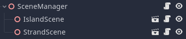
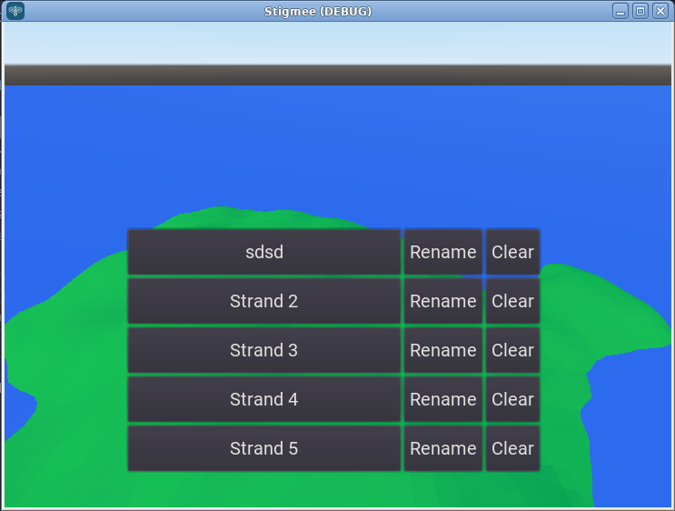
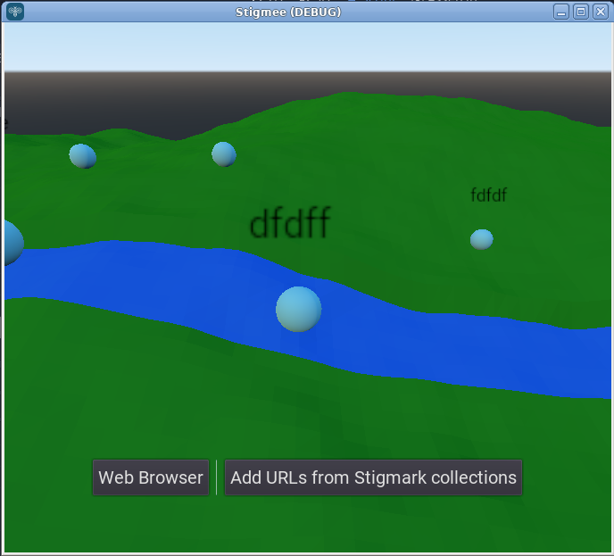
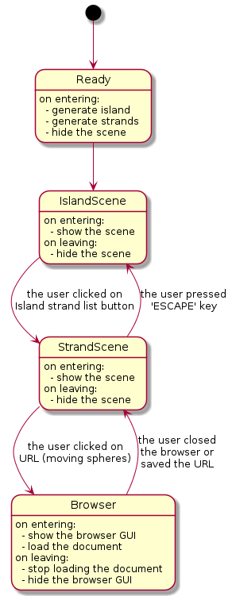
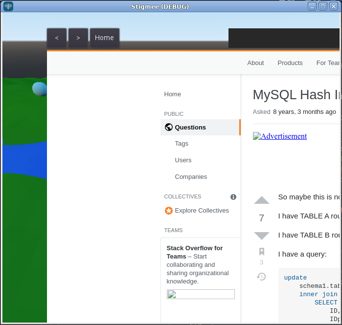
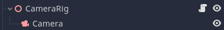

# Stigmee details design

This document only concerns the folder `stigmee` its [scene graph](https://youtu.be/_ImAgihyy3A)
and its code made in [gdscript](https://docs.godotengine.org/en/stable/tutorials/scripting/gdscript/gdscript_basics.html).
Please, read the associated documentation for other components (particurlaly Godot native modules)
that you can find in their respective Stigmee's GitHub repositories.

## Definitions

- `node`: alias for a saved URL.
- `strand`: collection of nodes along a river.
- `island`: collection of strands.
- `butineurs`:
- `explorateurs`:
- `ouvriers`:

## Scene Manager

Control which scene shall be displayed and which one shall be hiden.
A scene in Godot, is a sub scene graph that can be reused. The
following picture depicts the scene graph for the `SceneManager`.

The `SceneManager` shall contains child node which implement the following methods:
- `func load_scene():` called when `SceneManager` is on its `func _ready():` method.
- `func open_scene(data):` or `func open_scene():` when the new scene is needed.
- `func close_scene():` when the new scene is no longer needed.
- These methods shall be present by attaching a gdscript to the root node of the scene.

Currently, two scenes are controlled:
- `IslandScene` for showing the island.

- `StrandScene` for showing the collection of nodes along a strand.

The following picture depicts the state machine for the `SceneManager`. Its code is placed in
`scripts/SceneManager.gd`.

When the SceneManager is inside its `func _ready():` method. It will call the `func load_scene():`
for all its child nodes. Aech scene has a `func open_scene():` and `func close_scene():` methods
that are called when the SceneManager changes of state.

Note that the `Browser` (a GUI displaying a web browser based on Chromium techno) is currently not
a real scene. Anyway, when closing it will open the island scene.

## Camera Rig

Allows to control a unique child camera node. Its code is placed in `scripts/CameraRig.gd` and is a
portage of the Unity code based on this Youtube [video](https://youtu.be/rnqF6S7PfFA) made by Game Dev
Guide. Please watch his video!

